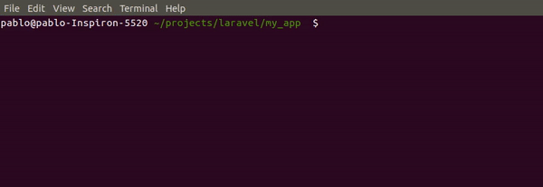

# eloquent-relationships

<p>Get eloquent relationships from model</p>

## Install

composer 2.x is required!

```sh
composer require pablo-merener/eloquent-relationships
```
## Helper

<p>Once the package is installed you will be able to use the rel helper which expects an Eloquent Model instance</p>

<p align='center'>
    
</p>